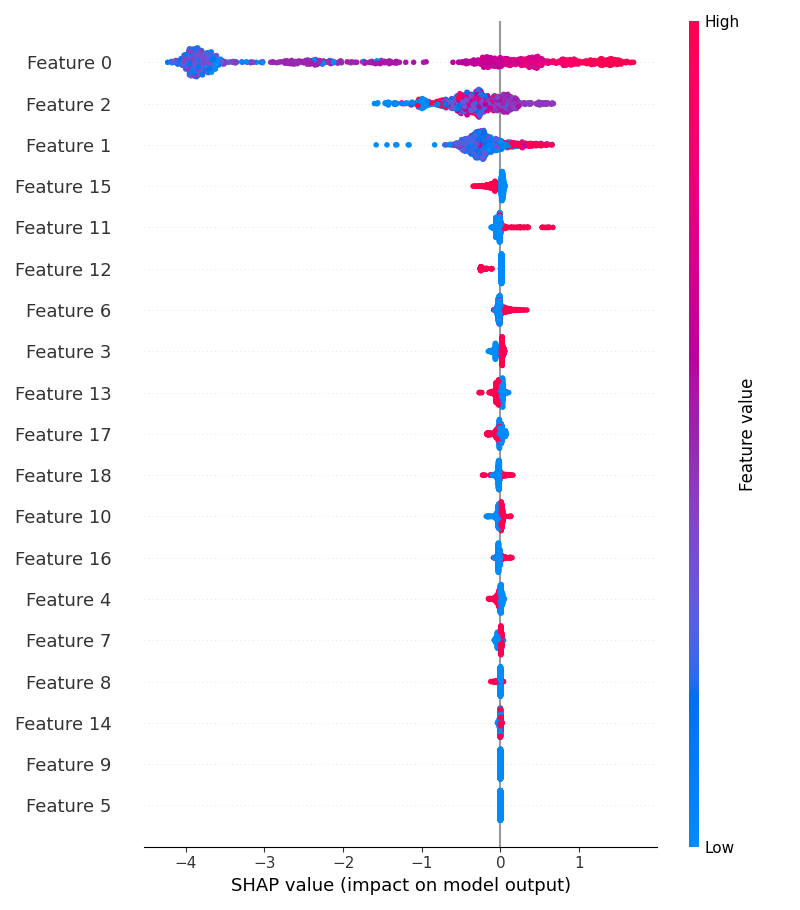

# Stroke Prediction Binary Classification

This project builds and evaluates multiple machine learning models to predict the likelihood of a stroke based on clinical and demographic features. Using exploratory analysis, feature importance tools (XGBoost + SHAP), and performance evaluation, the project aims to identify impactful predictors of stroke risk and assess model effectiveness.

Wil Sheffield  
May 2025

---

## Project Goals

- Perform binary classification to predict stroke occurrence (`stroke = 1`)  
- Analyze feature distributions and class imbalance  
- Use SHAP and XGBoost to interpret model behavior  
- Compare classifier performance across key metrics

---

## Repository Structure

```
├── visualizations/                  # All final plots & visual assets
│   ├── dist_age.png
│   ├── dist_avg_glucose_level.png
│   ├── dist_bmi.png
│   ├── stroke_distribution.png
│   ├── feature_importance.png
│   ├── xgb_feature_importance.png
│   └── shap_summary.png
├── 01_final_notebook.ipynb          # Full analysis and modeling notebook
├── 02_final_presentation.pdf        # Summarized project presentation
├── 03_data.csv                      # Kaggle-sourced cleaned dataset
├── 04_results_summary.csv           # Model performance results
└── README.md                        # Project documentation
```

---

## Methodology

### Dataset
- Sourced from Kaggle: clinical, behavioral, and demographic health data  
- Target: `stroke` (0 = No Stroke, 1 = Stroke)

### Workflow
1. **EDA**: Distribution of variables (`age`, `bmi`, `glucose`) and target class imbalance  
2. **Preprocessing**: One-hot encoding, scaling, imputation  
3. **Modeling**:
   - Logistic Regression  
   - Random Forest  
   - XGBoost  
   - k-Nearest Neighbors  
4. **Evaluation**: Accuracy, Precision, Recall, F1, ROC-AUC  
5. **Interpretability**:
   - XGBoost Feature Importances  
   - SHAP Value Analysis

---

## Key Visualizations

### Target Class Distribution  


### Input Feature Distributions  
  
  


### Model Interpretability  
  


---

## Model Performance Summary

| Model               | Accuracy | Precision | Recall | F1 Score | ROC-AUC |
|--------------------|----------|-----------|--------|----------|---------|
| XGBoost            | 0.781    | 0.157     | 0.800  | 0.263    | 0.846   |
| Decision Tree      | 0.906    | 0.141     | 0.180  | 0.158    | 0.562   |
| Random Forest      | 0.950    | 0.429     | 0.060  | 0.105    | 0.786   |
| Neural Net (MLP)   | 0.949    | 0.375     | 0.060  | 0.103    | 0.802   |
| Logistic Regression| 0.951    | 0.000     | 0.000  | 0.000    | 0.841   |
| k-Nearest Neighbors| 0.943    | 0.000     | 0.000  | 0.000    | 0.597   |

*(See `04_results_summary.csv` for raw metrics)*

### Key Insights

- **XGBoost** performed best in terms of recall (0.800) and AUC (0.846), making it the most sensitive to positive stroke cases.
- **Logistic Regression** and **k-NN** failed to identify any stroke cases, likely due to class imbalance and lack of complexity.
- While **Random Forest** and **MLP** had high overall accuracy, their recall scores were low, showing poor sensitivity.
- **Decision Tree** offered moderate recall but underperformed on AUC, suggesting limited generalizability.
- Class imbalance (as shown in the target distribution) significantly impacted model behavior and precision-recall tradeoffs.

---

## Technologies Used

- Python (Pandas, NumPy, Scikit-learn, XGBoost, SHAP, Seaborn, Matplotlib)
- Jupyter Notebook
- SHAP for model interpretability
- Kaggle dataset integration

---

## Future Improvements

- Use ensemble techniques for better class balancing  
- Test deep learning models (e.g. MLP, TabNet)  
- Integrate temporal or longitudinal features  
- Address feature sparsity and potential bias
